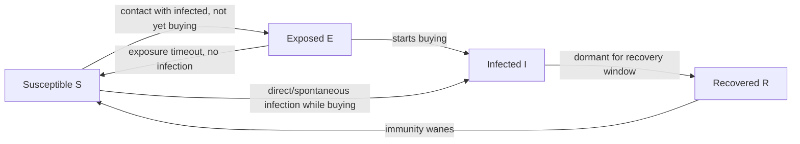
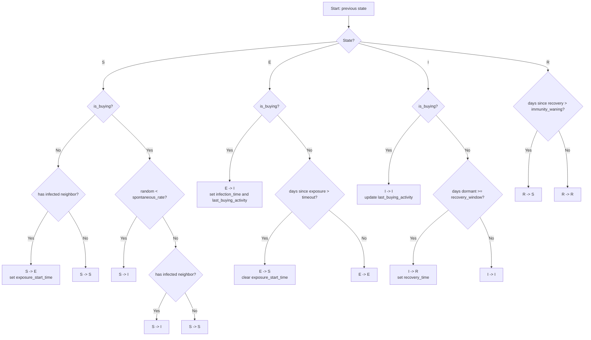

# Crypto Cascades

**Modeling FOMO Contagion in Bitcoin Networks Using SEIR Epidemic Dynamics**

---

## Research Motivation

Cryptocurrency markets exhibit sharp, sentiment-driven buying episodes commonly attributed to FOMO (Fear of Missing Out). These episodes share striking structural similarities with infectious disease outbreaks: a susceptible population, an incubation period after exposure to "infected" peers, a phase of active participation, and eventual recovery or dormancy. Despite this intuitive analogy, there is limited formal work applying compartmental epidemic models to real transaction-graph data to test whether FOMO propagation through a network genuinely follows epidemic dynamics — or whether the analogy breaks under quantitative scrutiny.

Crypto Cascades addresses this gap. The project applies the SEIR (Susceptible-Exposed-Infected-Recovered) compartmental model — a well-established framework from mathematical epidemiology — to the Bitcoin transaction graph, mapping wallet buying behavior to epidemic states and fitting transmission parameters to observed data. The aim is not to predict prices, but to characterize *how* sentiment-driven behavior spreads through a financial network and whether network topology amplifies that spread.

## Research Design

The study follows a **three-period quasi-experimental design** that strengthens causal inference:

| Period | Date Range | Market Regime | Role |
|--------|------------|---------------|------|
| **Training** | Oct 2017 -- Jan 2018 | Bull market (~$20k peak) | Fit SEIR parameters and develop state assignment rules |
| **Control** | Jun 2018 -- Dec 2018 | Bear market (crypto winter) | Verify suppressed transmission under low-sentiment conditions |
| **Validation** | Oct 2020 -- Jan 2021 | Bull market (~$40k peak) | Out-of-sample test of model generalizability |

This design allows the model to be trained on one FOMO episode, validated against a period where contagion should be minimal, and then tested on a structurally different bull run with institutional (rather than retail) participation.

## Hypotheses

The project tests six quantitative hypotheses, each with pre-specified statistical criteria:

| # | Hypothesis | Method | Acceptance Criterion |
|---|-----------|--------|---------------------|
| H1 | FOMO episodes follow SEIR epidemic dynamics | Vuong test (SEIR vs. null) + NRMSE CI | Vuong p < 0.05, NRMSE CI below threshold |
| H2 | Network topology amplifies contagion | Assortativity vs configuration model null (Fisher z-transform) | Observed r significantly different from null, p < 0.05 |
| H3 | Fear & Greed Index correlates with transmission rate | One-tailed Pearson correlation | r > 0.3, one-tailed p < 0.05 |
| H4 | High k-shell nodes are infected earlier | Cox PH survival analysis (concordance > 0.5) + Mann-Whitney U | Hazard ratio > 1, p < 0.05 |
| H5 | Community structure creates infection clusters | Permutation test (1000 iterations, edge-sampled) | Within > between community rate, p < 0.05 |
| H6 | FOMO transmission is stronger in bull markets | Cross-period R₀ comparison | Bull R₀ > Bear R₀ (requires `--phase three-period`) |

Multiple testing is corrected using the Benjamini-Hochberg FDR procedure across all six hypotheses.

## Datasets

| Dataset | Role | Size | Source |
|---------|------|------|--------|
| **ORBITAAL** | Primary Bitcoin transaction graph (2009--2021), monthly snapshots with real UNIX timestamps | 23 GB (full); 81 MB (samples) | [Zenodo](https://zenodo.org/records/12581515) |
| **SNAP Bitcoin OTC** | Supplementary trust network for validation | 700 KB | [Stanford SNAP](https://snap.stanford.edu/data/) |
| **SNAP Bitcoin Alpha** | Supplementary trust network for validation | 500 KB | [Stanford SNAP](https://snap.stanford.edu/data/) |
| **Fear & Greed Index** | Daily market sentiment indicator | ~50 KB | [Alternative.me API](https://alternative.me/crypto/fear-and-greed-index/) |
| **CoinGecko Prices** | Historical BTC/USD prices | ~100 KB | [CoinGecko API](https://www.coingecko.com/) |

## Methodology

### State Assignment

Wallets are classified into SEIR compartments based on observable on-chain behavior:

- **Susceptible (S):** No incoming BTC in the past 7 days.
- **Exposed (E):** Transacted with an Infected wallet within the past 24 hours but not yet actively buying. Reverts to S after a configurable timeout (default: 14 days) if no infection occurs.
- **Infected (I):** Net BTC inflow exceeds a z-score threshold (default: 1.5σ above wallet mean), replacing the prior binary threshold. Spontaneous infection (importation) is also supported.
- **Recovered (R):** Dormant for 3+ days following an Infected phase. Returns to Susceptible after 30 days (waning immunity).

> **Note:** Because the ORBITAAL transaction graph contains only wallets that have transacted, the Susceptible compartment is structurally zero (S = 0) from t = 0 onward. All observed wallets enter the system already in E or I states. This is an empirical finding, not a bug — it reflects the nature of transaction-graph data versus population-level surveillance data.

#### High-Level State Loop



#### Detailed Transition Decision Tree



### SEIR Dynamics

The pipeline uses two simulation approaches:

**Homogeneous Mean-Field ODE** (baseline) with sigmoidal FOMO amplification:

```
dS/dt = -β_eff * S * I / N + ω * R
dE/dt =  β_eff * S * I / N - σ * E
dI/dt =  σ * E - γ * I
dR/dt =  γ * I - ω * R
```

Where `β_eff = min(β × (1 + α × expit(k × (FGI - 50) / 50)), 0.99)` uses a bounded sigmoidal coupling to the Fear & Greed Index, preventing runaway transmission rates.

**Heterogeneous Mean-Field (HMF) ODE** (network-aware, Pastor-Satorras & Vespignani 2001) partitions nodes into ~30 logarithmically-binned degree classes and solves a coupled degree-class ODE system (~120 equations) using the BDF stiff solver. This captures topology-dependent spreading — including the network-corrected R₀ = β⟨k²⟩/(⟨k⟩γ) — without requiring infeasible stochastic simulation on the full 30M-node graph.

### Parameter Estimation

Parameters (β, σ, γ, ω) are estimated via:

- **Least-squares fitting** of ODE trajectories to observed compartment counts (default).
- **Multinomial MLE** respecting the S+E+I+R=N population constraint.
- **Stationary block bootstrap** (Politis & Romano 1994) with 2000 resamples for confidence intervals, preserving temporal autocorrelation.
- **Bayesian estimation** via NumPyro NUTS sampler with Dirichlet-Multinomial likelihood (optional).
- **Sensitivity analysis** computing elasticity of R₀ with respect to each parameter.

Model selection uses AIC, AICc (small-sample corrected), and BIC. The Cori et al. method provides instantaneous R(t) estimates for epidemic phase tracking.

## Project Structure

```
Crypto-Cascades/
├── configs/
│   └── config.yaml                  # All parameters (YAML, 80+ settings)
├── data/
│   └── raw/                         # Downloaded datasets (via --phase download)
│       ├── orbitaal/                # ORBITAAL transaction graph (parquet/CSV)
│       ├── snap/                    # Bitcoin trust networks
│       └── market/                  # BTC price history & Fear & Greed Index
├── src/
│   ├── main.py                      # Pipeline orchestrator (CLI entry point)
│   ├── data_acquisition/            # Phase 1: Dataset downloaders
│   ├── preprocessing/               # Phase 2: Parsing & graph construction
│   ├── network_analysis/            # Phase 3: Centrality, communities, topology
│   ├── state_engine/                # Phase 3-4: SEIR state assignment (combined with analysis)
│   ├── epidemic_model/              # Phase 5: HMF degree-class ODE & mean-field simulation
│   ├── estimation/                  # Phase 6: Parameter fitting & model comparison
│   ├── hypothesis/                  # Phase 7: Statistical hypothesis testing (H1--H5, H6 via three-period)
│   ├── validation/                  # Trust network validation (SNAP comparison, run during Phase 7)
│   ├── visualization/               # Phase 8: Publication-quality figures
│   └── utils/                       # Config, constants, logging, exceptions
├── results/                         # Pipeline outputs (generated, git-ignored)
│   ├── data/                        # Processed DataFrames, state assignments, observed curves
│   ├── figures/                     # Generated plots
│   ├── reports/                     # Analysis reports, hypothesis results
│   └── periods/                     # Per-period outputs for three-period analysis
├── tests/                           # Pytest suite
├── docs/                            # Documentation & research report
├── pyproject.toml                   # Project metadata, Ruff, pytest config
├── requirements.txt                 # Python dependencies
└── setup.sh                         # Environment setup script
```

## Pipeline Phases

The analysis pipeline is executed through `src/main.py` and can be run end-to-end or phase-by-phase:

| Phase | CLI flag | Module | Description |
|-------|----------|--------|-------------|
| 1 | `download` | `data_acquisition/` | Download ORBITAAL, SNAP, market, and sentiment data |
| 2 | `preprocess` | `preprocessing/` | Parse ORBITAAL parquets, build igraph transaction graphs, filter FGI by period |
| 3-4 | `analyze` | `network_analysis/` + `state_engine/` | Compute centrality (k-shell, degree), detect communities (Leiden), assign SEIR states |
| 5 | `simulate` | `epidemic_model/` | Run HMF degree-class ODE (BDF solver) for network-aware SEIR simulation |
| 6 | `estimate` | `estimation/` | Fit β, σ, γ, ω to observed state curves; compute R₀ and bootstrap CIs |
| 7 | `test` | `hypothesis/` | Test H1--H5 with Vuong test, Fisher z-transform, Cox PH, permutation tests, FDR correction |
| 8 | `visualize` | `visualization/` | Generate SEIR curves, network plots, hypothesis result figures |
| -- | `three-period` | (orchestrator) | Run full Training/Control/Validation analysis; tests H6 cross-period R₀ comparison |

## Getting Started

See [docs/GETTING_STARTED.md](docs/GETTING_STARTED.md) for a complete setup and usage guide.

### Quick Start

```bash
# Clone and setup
git clone https://github.com/Xhadou/Crypto-Cascades.git
cd Crypto-Cascades
pip install -r requirements.txt

# Run the full pipeline
python -m src.main --phase all --config configs/config.yaml

# Run tests
pytest tests/ -v
```

## Key Technologies

| Category | Libraries |
|----------|-----------|
| Scientific computing | NumPy, Pandas, SciPy, PyArrow |
| Network analysis | python-igraph (primary), leidenalg, powerlaw, NetworkX (secondary, small subgraphs only) |
| Epidemic modeling | Custom HMF degree-class ODE (BDF solver via SciPy) |
| Statistical inference | arch (block bootstrap), lifelines (survival analysis), scikit-learn |
| Visualization | Matplotlib, Seaborn, SciencePlots (optional) |
| Configuration | PyYAML, Pydantic, Pydantic Settings |
| Bayesian estimation | NumPyro, JAX (optional) |
| Data acquisition | Requests, PyCoinGecko |
| Testing | Pytest, pytest-cov |

## Configuration

All parameters are centralized in `configs/config.yaml`, including:

- SEIR initial parameter guesses and bounds
- State assignment thresholds (z-score threshold, exposure timeout, spontaneous infection rate)
- Time windows for each analysis period
- Network filtering criteria and computational thresholds
- Bootstrap and Monte Carlo sample counts
- Visualization settings (including optional SciencePlots integration)

No magic numbers are hardcoded in source modules. Computational thresholds are config-driven to handle graphs of varying sizes.

## Justification as a Research Project

This project satisfies the criteria for computational research along several dimensions:

1. **Novel interdisciplinary framing.** While epidemic models have been applied to information diffusion on social media, applying SEIR dynamics to *actual transaction graphs* with real timestamps and linking transmission rates to a quantitative sentiment index (Fear & Greed) is underexplored in the literature.

2. **Testable, falsifiable hypotheses.** The six hypotheses (H1--H6) have pre-specified acceptance criteria and statistical tests. The three-period design with a dedicated control period (bear market) provides a natural counterfactual: if the model is merely fitting noise, it should fail to show suppressed transmission during the bear market and fail to generalize to the 2020--2021 validation period.

3. **Methodological rigor.** Parameter estimation uses stationary block bootstrap (2000 resamples) preserving temporal autocorrelation. Hypothesis testing applies multiple-testing correction (Benjamini-Hochberg). Both homogeneous and heterogeneous mean-field (HMF) ODE approaches are compared. Model selection uses information criteria (AIC/AICc/BIC). H4 employs Cox proportional hazards survival analysis with k-shell centrality. H2 uses Fisher z-transform against configuration model null. H5 uses nonparametric permutation tests with edge sampling.

4. **Reproducibility.** The pipeline is fully automated from data download to figure generation. All parameters live in a single YAML configuration file. The codebase includes 430+ tests across 18 test modules. Instance-level RNG (`np.random.default_rng`) with `SeedSequence` ensures reproducible parallelism.

5. **Real-world data at scale.** The primary dataset (ORBITAAL) contains the complete Bitcoin transaction graph from 2009 to 2021 — not synthetic or simulated data. This grounds the research in observable economic behavior rather than theoretical assumptions.

6. **Software engineering discipline.** Modular architecture with separation of concerns across 7 pipeline phases plus a three-period orchestrator. Custom exception hierarchy, structured logging, Pydantic config validation, and modern Python packaging (`pyproject.toml`). igraph C backend handles 30M+ node graphs natively; optional high-performance backends (NetworKit, NumPyro/JAX) with graceful fallbacks.

## License

This project is for academic research purposes.

## References

- ORBITAAL Dataset: [Zenodo Record 12581515](https://zenodo.org/records/12581515)
- SNAP Bitcoin Networks: [Stanford SNAP](https://snap.stanford.edu/data/)
- Fear & Greed Index: [Alternative.me](https://alternative.me/crypto/fear-and-greed-index/)
- Kermack, W. O., & McKendrick, A. G. (1927). A contribution to the mathematical theory of epidemics. *Proceedings of the Royal Society A*, 115(772), 700--721.
- Politis, D. N., & Romano, J. P. (1994). The stationary bootstrap. *Journal of the American Statistical Association*, 89(428), 1303--1313.
- Cori, A., et al. (2013). A new framework and software to estimate time-varying reproduction numbers during epidemics. *American Journal of Epidemiology*, 178(9), 1505--1512.
